# 도토리주머니 v2 고도화 결과 보고서

- 작성일: 2026-09-29
- 범위: 저장소 `jay05410/acorn-collector`, PR #1~#13 (모두 리뷰 후 `main`에 머지)
- 검증 환경: macOS, Chrome for Testing 154 + Playwright로 실제 확장을 로드해 확인. 합성 가격표 이미지 6장으로 실측.

## 1. 요약

| 요구사항                                            | 결과                                                                                                                       | 근거           |
| --------------------------------------------------- | -------------------------------------------------------------------------------------------------------------------------- | -------------- |
| Gemini 대신 더 빠르고 정확한 분석 모델              | OpenAI `gpt-6-luna`(추론 none)를 기본값으로, 호출당 2.2~4.2초. Gemini 코드·의존성 완전 제거                                | 3장 벤치마크   |
| 영역별 DOM 파싱 대신 분석 가능한 형태로 페이지 수집 | 보고 있는 페이지를 구조화 스냅샷으로 변환. X 원문 복원, BOOTH 상품 JSON 직접 사용, 일반 페이지는 필요 시에만 defuddle 주입 | ACORN-5, PR #5 |
| "jev" / crawl4ai 검토                               | 둘 다 부적합으로 판단하고 로컬 결정적 판단기로 대체                                                                        | 2장            |
| 크레딧 제거, 본인 OpenAI·Claude 계정 연결           | 서버·크레딧·결제·로그인 삭제. OpenRouter OAuth, API 키, 로컬 CLI(Claude Code·Codex) 연결                                   | ACORN-2·4·6·7  |
| 서버에 저장되는 값 없음                             | 서버 코드 삭제. 데이터는 브라우저(IndexedDB·chrome.storage)에만 저장                                                       | 6장            |
| 수익 모델: 후원 + 광고(필수)                        | 정책을 지키는 스폰서 피드 광고 3개 슬롯 + Buy Me a Coffee·GitHub Sponsors 링크                                             | ACORN-8        |
| 다국어 필수, 외국 이미지 분석                       | 한국어·영어·일본어·중국어(간체·번체). 이미지 속 언어와 통화를 그대로 인식하고 상품명은 UI 언어로 번역, 원문은 별도 보관    | ACORN-3·9, 3장 |
| 확장성                                              | 언어는 폴더 추가로 확장(`docs/v2/I18N.md`), 프로바이더·사이트 추출기·광고 슬롯은 등록 방식                                 | ACORN-9 등     |
| 디자인 개선                                         | 디자인 시스템(토큰·컴포넌트), 명암비 AA, 다크 모드, 레이아웃 결함 수정                                                     | 4장            |
| 프로덕트 급 품질                                    | 테스트 0개 → 1,756개, CI(타입·린트·테스트·빌드·원격 코드 검사·i18n 검사), PR 리뷰 지적 90건 수정 또는 근거 답변            | 5장            |

## 2. 요청 전제에 대한 확인 결과

사실(출처 있음)과 판단을 구분했다.

| 전제                           | 확인된 사실                                                                                                                                                                                                                                                                                                                                                              | 판단                                                                                              |
| ------------------------------ | ------------------------------------------------------------------------------------------------------------------------------------------------------------------------------------------------------------------------------------------------------------------------------------------------------------------------------------------------------------------------ | ------------------------------------------------------------------------------------------------- |
| "Gemini가 너무 느리다"         | 기존 코드는 `gemini-2.5-flash`에 thinking 설정을 하지 않아 동적 thinking이 켜져 있었다([Google 문서](https://ai.google.dev/gemini-api/docs/generate-content/thinking)). 실측 호출당 약 8초, thinking 토큰 626~747개. 서버 경로는 2회 순차 호출. 측정 중 503(과부하)·429(할당량 초과)가 반복됐다. 신규 사용자는 2.5 계열 접근이 제한된다(Google 모델 페이지, 2026-09-22). | 느림의 상당 부분은 설정 문제였다. 소유자 결정대로 Gemini는 전면 제외했다.                         |
| "jev를 쓰자"                   | Jev는 TypeSafe AI가 2026-09-15 공개한 텍스트 전용 판단 모델([docs.typesafe.ai](https://docs.typesafe.ai/models.md)). 페이지나 이미지를 읽지 못하고, 공식 문서가 CJK 정확도가 낮다고 밝힌다. 키를 확장에 넣을 수 없어 소유자 운영 서버가 필요하다. 2026-09-22 신규 가입 중단 공지가 있었다.                                                                               | "정적 판단" 단계를 로컬 파서로 구현(비용 0, 약 5ms, 오프라인).                                    |
| "crawl4ai 같은 오픈소스"       | crawl4ai 0.9.4는 Python + Playwright 서버 도구. 로그인이 필요한 X 게시글은 서버에 사용자 세션을 둬야 읽는다. Jina Reader는 2026-09-29 x.com 요청에 403을 반환했다.                                                                                                                                                                                                       | 서버 무저장 원칙·X 약관과 충돌하므로 채택하지 않았다.                                             |
| "OpenAI·Claude를 OAuth로 연결" | Anthropic은 제3자 앱의 Claude.ai 로그인 제공과 토큰 중개를 명시적으로 금지한다([Claude Code 법적 고지](https://code.claude.com/docs/en/legal-and-compliance.md)). OpenAI는 제3자용 ChatGPT OAuth 프로그램 문서가 없다(2026-09-29 기준, DevDay 발표는 미확인).                                                                                                            | 허용 경로만 구현: OpenRouter OAuth(PKCE), API 키, 사용자가 직접 로그인한 로컬 CLI 브리지(옵트인). |
| "광고는 무조건"                | AdSense는 브라우저 확장 게재를 명시적으로 금지한다([AdSense 정책](https://support.google.com/adsense/answer/1346295)). MV3는 원격 스크립트를 금지하지만 원격 JSON 데이터는 허용한다([Chrome 정책](https://developer.chrome.com/docs/webstore/program-policies/policies)).                                                                                                | 번들 코드가 JSON 스폰서 피드를 렌더링하는 방식. "광고" 표기, 개인화·추적 없음.                    |
| 토스 후원                      | toss.me는 서비스 종료 안내로 리다이렉트된다. Buy Me a Coffee는 한국 정산을 지원한다(2026-08-24 도움말).                                                                                                                                                                                                                                                                  | Buy Me a Coffee + GitHub Sponsors 링크.                                                           |

## 3. 속도·정확도 실측

합성 가격표 6장(한국어, 일본어, 번체, 간체, 영어, 손글씨체 한국어), 이미지 1장당 1회 호출. 실제 사진(반사, 기울어짐)보다 쉬운 조건이라는 한계가 있다.

| 구성                                                     | 호출당 지연                             | 상품 인식           | 가격 | 통화       |
| -------------------------------------------------------- | --------------------------------------- | ------------------- | ---- | ---------- |
| 기존: gemini-2.5-flash, thinking 기본값                  | 약 8.0~8.2초 (성공 2회, 나머지 503·429) | 2/2 정확            | 정확 | 측정 안 함 |
| **새 기본값: gpt-6-luna, 추론 none**                     | **2.2~4.2초**                           | 6/6 전부            | 6/6  | 6/6        |
| gpt-6-luna, 추론 low                                     | 4.3~7.9초                               | 1장에서 1개 누락    | —    | 6/6        |
| gpt-6-sol, 추론 none                                     | 4.1~5.2초                               | 6/6                 | 6/6  | 6/6        |
| 로컬 CLI(Claude Code 구독, Chrome 없이 호스트 직접 호출) | 이미지당 9.8~13.3초                     | 정확(일본어 픽스처) | 정확 | —          |

| 여러 장 처리 방식(3장)    | 벽시계 시간 |
| ------------------------- | ----------- |
| 한 번의 호출에 3장        | 4.6~5.2초   |
| 이미지별 병렬 호출 (채택) | 2.7~3.4초   |

실제 확장 E2E(2026-09-29, main 빌드): 한국어 게시글 + 한국어·일본어 가격표 2장.

| 측정                       | 값                                                             |
| -------------------------- | -------------------------------------------------------------- |
| 캡처 전달 → 첫 상품 표시   | 3.4초                                                          |
| 캡처 전달 → 13개 전부 완료 | 4.7초                                                          |
| 통화 처리                  | 한국어 7개는 행사 통화(KRW) 상속, 일본어 6개는 JPY로 별도 저장 |
| 같은 부스 재분석           | 로컬 캐시 적중, API 호출 0회                                   |

## 4. 화면 비교 (같은 샘플 데이터, 400px)

| 개선 전                                       | 개선 후                                     |
| --------------------------------------------- | ------------------------------------------- |
| 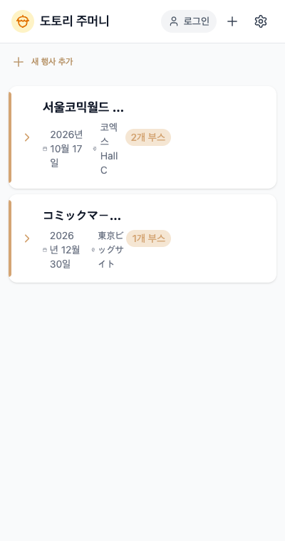              | 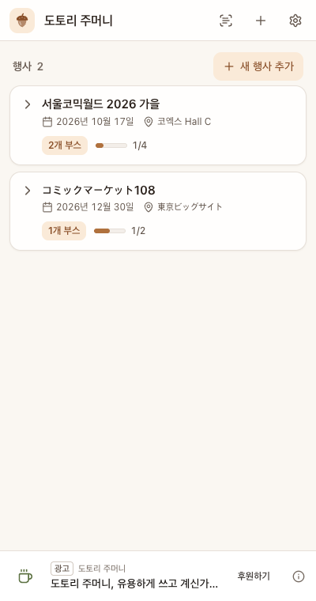             |
| 행사 카드 레이아웃 붕괴, 로그인 버튼          | 카드 정상, 진행률, 하단 광고 슬롯           |
| 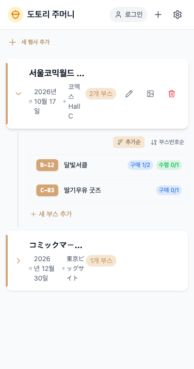      | 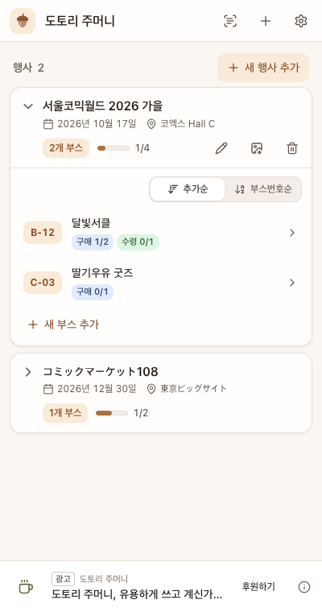     |
| 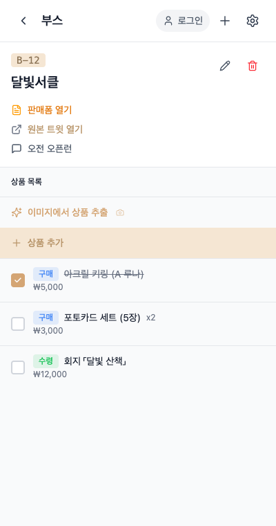        | 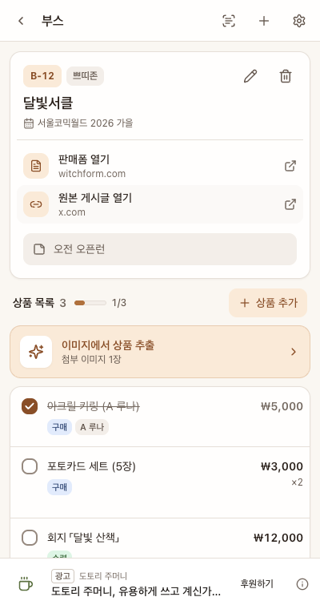       |
| 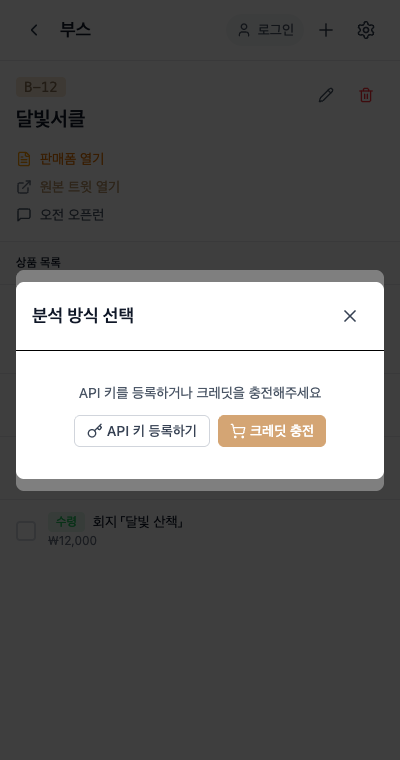     | 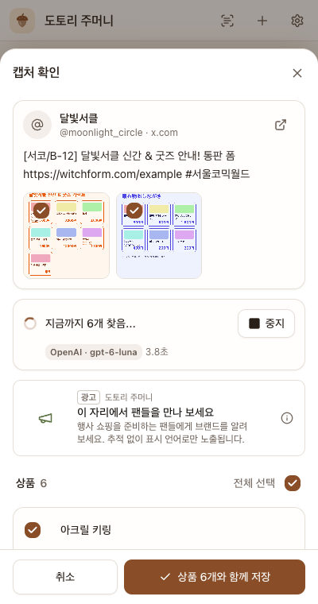 |
| 키가 없으면 크레딧 결제 유도                  | 본인 AI로 스트리밍 추출                     |
| 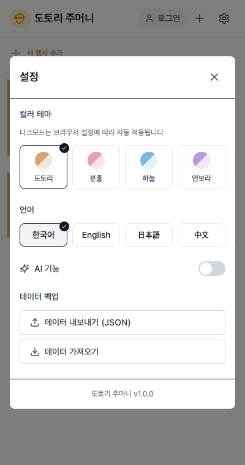            | 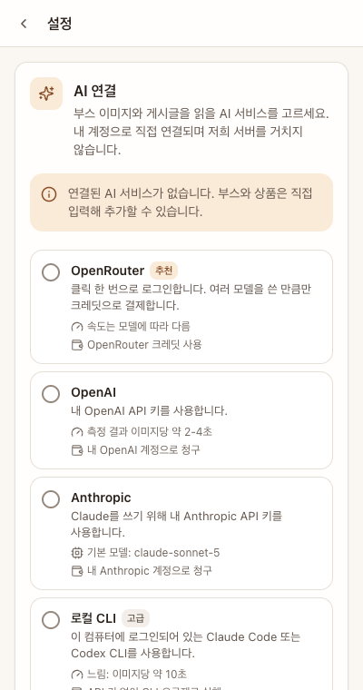           |
| 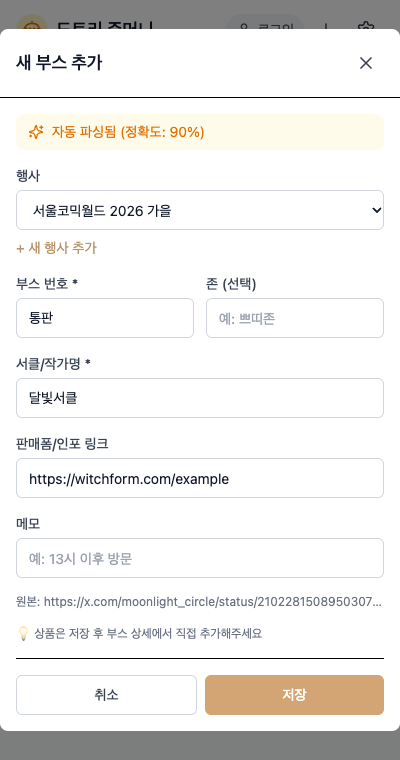 | 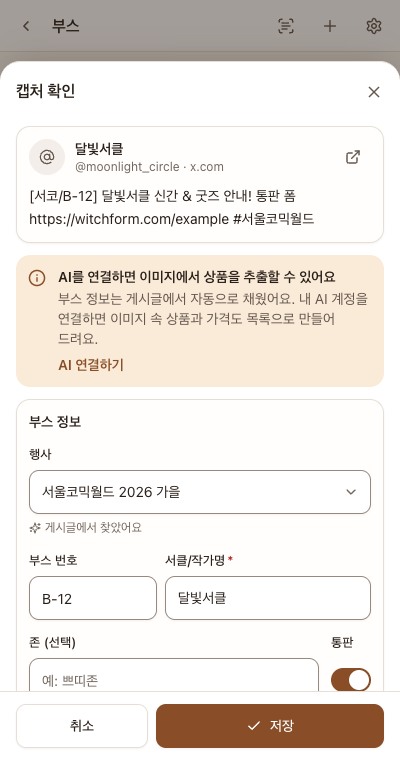     |
| 부스 번호를 "통판"으로 오인식                 | B-12, 통판 표시, 행사 자동 매칭             |

추가 화면: [첫 실행 안내](report/x-first-run.png), [분석 완료](report/after-04b-analysis-done.png), [저장된 부스(₩·JP¥)](report/x-saved-booth-krw-jpy.png), [로컬 CLI 상태(네이티브 메시징 응답은 모의)](report/x-cli-status.png), [OpenRouter 연결](report/x-openrouter-connected.png), [후원·광고](report/x-settings-bottom-support.png), [다크 모드](report/x-dark-events.png), [일본어](report/x-ja-events.png), [번체 중국어](report/x-zhTW-events.png), [영어](report/x-en-events.png).

## 5. 품질 지표

| 항목            | 개선 전                   | 개선 후                                                    |
| --------------- | ------------------------- | ---------------------------------------------------------- |
| 자동 테스트     | 0개                       | 1,756개 통과 (vitest, 실호출 전용 2개는 건너뜀)            |
| CI              | 없음(문서 배포만, 미추적) | 타입체크, 린트, 테스트, 빌드, 원격 코드 검사, i18n 완전성  |
| 타입체크        | 오류 2건                  | 0건                                                        |
| 사이드패널 번들 | 785 kB (Gemini SDK 포함)  | 710 kB, gzip 222 kB. 언어별 청크 약 9~10 kB는 필요 시 로드 |
| PR 리뷰         | —                         | 12개 PR에서 인라인 지적 90건, 전부 수정 또는 근거 답변     |
| 명암비          | 주 버튼 약 2.2:1          | 모든 텍스트 4.5:1 이상                                     |

## 6. 데이터 흐름과 권한

- 저장: IndexedDB(행사·부스·상품·분석 캐시), chrome.storage.local(설정, API 키), chrome.storage.session(캡처 전달, 메모리 전용).
- 외부 전송: 사용자가 고른 AI 프로바이더(분석 실행 시 또는 자동 분석 켜짐 시), 스폰서 피드(raw.githubusercontent.com, IP·UA만 노출), 장소 검색(Kakao·Google Places, 선택).
- 권한: storage, contextMenus, activeTab, sidePanel, identity(OpenRouter OAuth), scripting(추출기 주입), 선택 권한 nativeMessaging(CLI 브리지), 단축키 Alt+Shift+A.

## 7. 소유자 조치 필요 항목

1. `codedocs.config.ts`에 평문으로 있던 OpenAI 키는 환경변수 참조로 바꿨다. 이미 노출된 키이므로 **키를 교체(rotate)** 해야 한다.
2. GitHub Sponsors 활성화(현재 링크가 프로필로 리다이렉트) 또는 `VITE_GH_SPONSORS_URL=off`, Buy Me a Coffee 주소 `VITE_BMC_URL` 설정.
3. 스토어 등록 후 `VITE_CWS_URL`, 개인정보 처리방침 URL 설정. 스토어 문구는 `docs/STORE_LISTING.md`.
4. 번들에 포함되는 Kakao·Google Places 키는 각 콘솔에서 API·할당량 제한을 걸 것.
5. 실제 계정으로 확인 필요: OpenRouter 로그인(chromiumapp.org 콜백 수락 여부), Anthropic 키 실호출, Chrome을 경유한 CLI 브리지 왕복(macOS 포함), Windows·Whale용 CLI 브리지 설치.

## 8. 알려진 한계와 위험

- 로컬 CLI 브리지: Anthropic 문서가 양방향으로 해석될 수 있는 영역이다. 옵트인·선택 권한으로만 제공하고 앱 안에서 약관 확인을 안내한다.
- X 원문 복원(syndication)과 BOOTH 상품 JSON은 비공식 엔드포인트다. 실패하면 화면 텍스트로 자동 대체된다.
- 벤치마크는 합성 이미지 기반이다. 실제 사진 50~100장 평가셋으로 기본 모델을 재검증하는 것을 권장한다.
- 광고는 노출 수를 집계하지 않는다(서버 무저장). 스폰서에게는 UTM 기반 클릭만 제공된다.

## 9. 참고 문서

- 아키텍처 결정: `docs/v2/ADR-001-architecture.md`
- 작업 보드와 리뷰 기록: `docs/v2/TICKETS.md`
- 다국어 구조와 언어 추가: `docs/v2/I18N.md`
- CLI 브리지 설치: `native-host/README.md`
- 광고 피드 운영: `sponsors/README.md`
- 개인정보 처리방침: `docs/PRIVACY.md`
